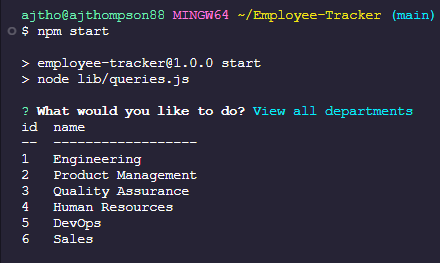
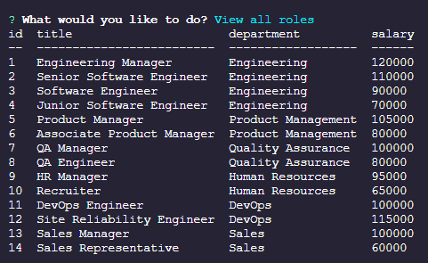
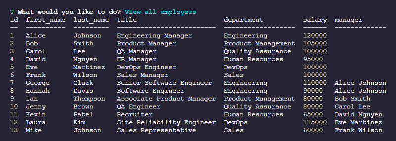

# Employee Tracker

## Description
A command-line interface (CLI) application for managing a company's employee database, built with Node.js, Inquirer, and PostgreSQL. This app allows you to view, add, and update departments, roles, and employees, meeting all the specified acceptance criteria for an employee tracking system.

---

## Table of Contents

- [Description](#description)
- [Acceptance Criteria](#acceptance-criteria)  
- [Screenshots](#screenshots)  
- [Walkthrough Video](#walkthrough-video)
- [Installation](#installation)  
- [Usage](#usage)  
- [Project Structure](#project-structure)  
- [Technologies](#technologies)  
- [Contributing](#contributing)  
- [License](#license)  

---

## Acceptance Criteria

- **WHEN** I start the application **THEN** I am presented with the following options:
  - View all departments
  - View all roles
  - View all employees
  - Add a department
  - Add a role
  - Add an employee
  - Update an employee role

- **WHEN** I choose **View all departments** **THEN** I see a formatted table showing department names and ids.  
- **WHEN** I choose **View all roles** **THEN** I see job title, role id, department, and salary.  
- **WHEN** I choose **View all employees** **THEN** I see employee id, first name, last name, title, department, salary, and manager.  
- **WHEN** I choose **Add a department** **THEN** I am prompted for the department name and it is added to the database.  
- **WHEN** I choose **Add a role** **THEN** I am prompted for the role name, salary, and department, and it is added.  
- **WHEN** I choose **Add an employee** **THEN** I am prompted for first name, last name, role, and manager, and the employee is added.  
- **WHEN** I choose **Update an employee role** **THEN** I am prompted to select an employee and a new role, and the database updates accordingly.

---

## Screenshots
 






## Walkthrough Video

Download or play the demo here:

[▶️ View the demo video (MP4)](./assets/Employee_Tracker.mp4)

---

## Installation

1. Clone the repository:
  ```
   git clone https://github.com/yourusername/employee-tracker.git

   cd employee-tracker

   cp .env.example .env

   npm install or npm i

   npm run create

   npm run seed

   npm start


  
---
## Usage
Show how to actually run and interact with the application.  

- **Launch** command (`npm start` or `npm run dev`)  
- **Walkthrough** of the menu options  
- **Example** screenshots or code snippets demonstrating one or two flows  

```
Start the CLI app:

npm start
```
## Technologies

List the main tools, libraries, and languages used.  

- **Node.js** v16+  
- **Inquirer** v8.2.4 (for CLI prompts)  
- **pg** (node-postgres) for database access  
- **PostgreSQL** (database engine)  
- **dotenv** (environment variable management)  
- **console.table** (formatted console output)  

---

## Contributing

Tell others how they can help improve your project. At minimum:

- **Fork** the repo  
- **Create** a feature branch (`git checkout -b feature/name`)  
- **Commit** your changes (`git commit -m "Add feature"`)  
- **Push** to your branch (`git push origin feature/name`)  
- **Open** a Pull Request describing your change  

You can also mention coding style, testing guidelines, or a code of conduct if you have one.

---

## License

This project is licensed under the terms of the [MIT License](./LICENSE).